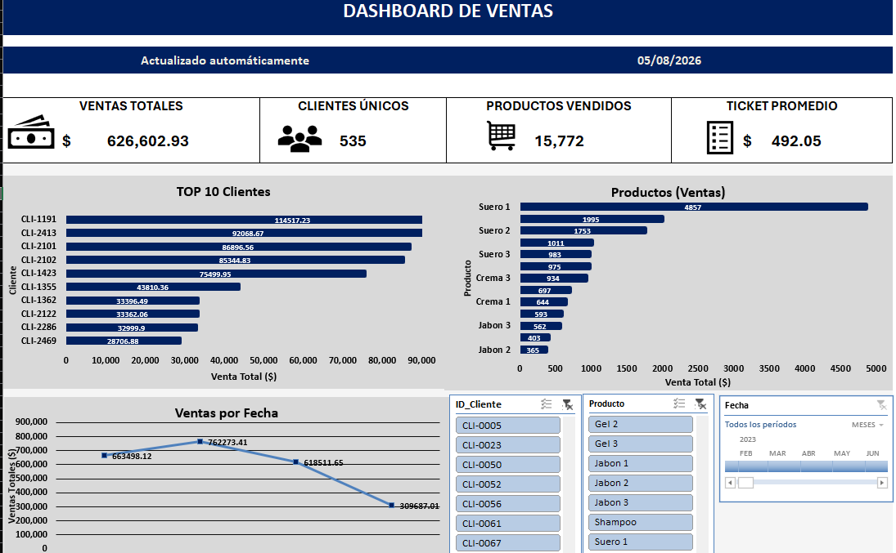
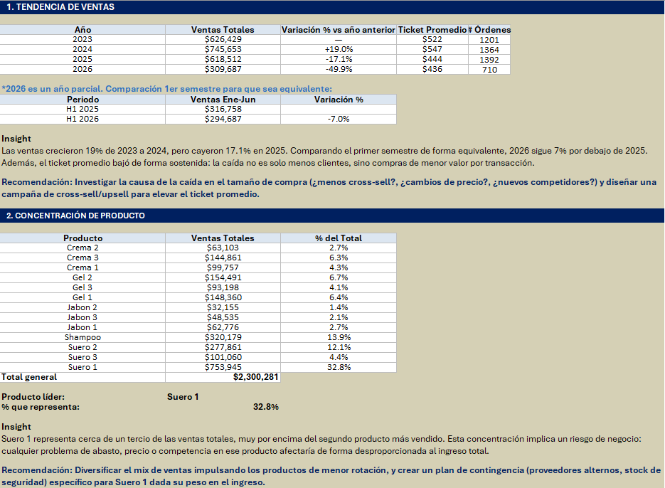
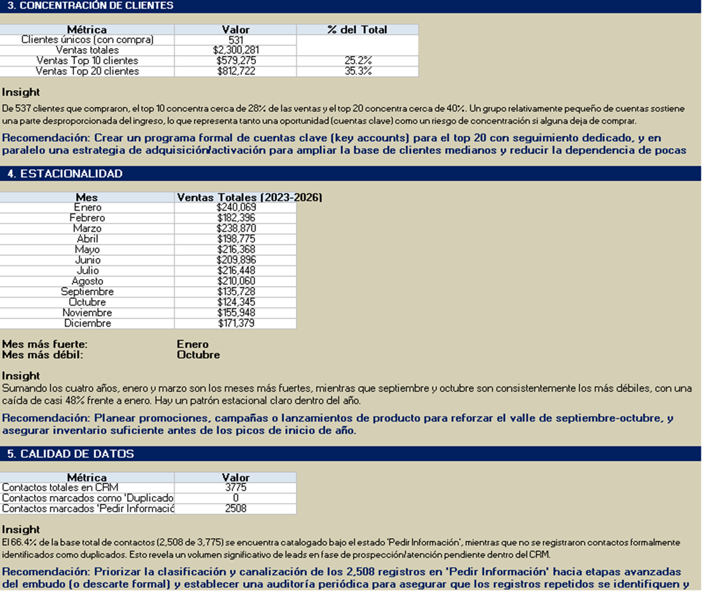

# 📊 Sales Dashboard — Microsoft Excel

Interactive sales analysis dashboard developed in Microsoft Excel to monitor sales performance, customer behavior, product performance, and business trends.

---

## 📌 Project Overview

The objective of this project was to transform sales data into an interactive dashboard that allows users to monitor key business metrics, analyze customer and product performance, identify trends, and generate actionable recommendations.

The project covers the complete analytical process:

**Data Preparation → Analysis → Visualization → Insights → Recommendations**

The dataset has been fully anonymized for portfolio purposes.

---

## 🛠️ Tools & Skills

**Tools:** Microsoft Excel, PivotTables, PivotCharts, Slicers, Timeline

**Skills:**
- Data cleaning and preparation
- Exploratory data analysis
- KPI development
- Data visualization
- Customer and product analysis
- Trend and seasonality analysis
- Business insights and recommendations

---

## 📊 Dashboard

The dashboard includes four main KPIs:

| KPI | Description |
|---|---|
| **Total Sales** | Total revenue generated |
| **Unique Customers** | Number of distinct customers |
| **Products Sold** | Total quantity of products sold |
| **Average Ticket** | Average sales transaction value |

### Interactive Features

- Customer ID slicer
- Product slicer
- Date timeline

### Visualizations

- Customer vs. Total Sales ($)
- Product vs. Total Sales ($)
- Total Sales ($) vs. Year

---

## 🔎 Key Findings

| Area | Key Finding |
|---|---|
| 📈 **Sales** | Sales increased 19% from 2023 to 2024, followed by a 17.1% decline in 2025 |
| 🧴 **Product** | Suero 1 represents approximately 32.8% of total sales |
| 👥 **Customers** | Top 20 customers represent approximately 39.9% of total sales |
| 📅 **Seasonality** | January and March show the highest sales levels. September and October show the lowest sales levels |
| 📋 **CRM** | 66.4% of contacts require further classification or follow-up |

### Business Recommendations

- Increase average ticket through cross-selling and upselling.
- Diversify the product sales mix.
- Develop a key-account strategy for high-value customers.
- Strengthen commercial activity during low-season periods.
- Improve CRM data classification and follow-up.

---

## 🔎 Findings & Recommendations

### Sales, Product & Customer Analysis

### Seasonality & CRM Data Quality

---

## 🔐 Data Privacy

The dataset has been anonymized.

The following information was modified or replaced:

- Customer IDs
- Email addresses
- Phone numbers
- Product names

No real customer contact information is included in the published project.

---

## 📚 What I Learned

Through this project, I practiced:

- Building interactive dashboards in Excel.
- Designing KPIs for business performance monitoring.
- Using PivotTables and PivotCharts for analysis.
- Creating interactive filters with slicers and timelines.
- Translating data analysis into business recommendations.

---

## 🚀 Future Improvements

- Recreate the dashboard in Power BI.
- Automate data refresh and reporting.
- Develop customer segmentation.
- Add customer retention and repeat-purchase metrics.
- Incorporate profitability indicators.

---

## 📎 Project File

The complete interactive Excel dashboard is available in:

**`Proyecto_Dashboard.xlsx`**
